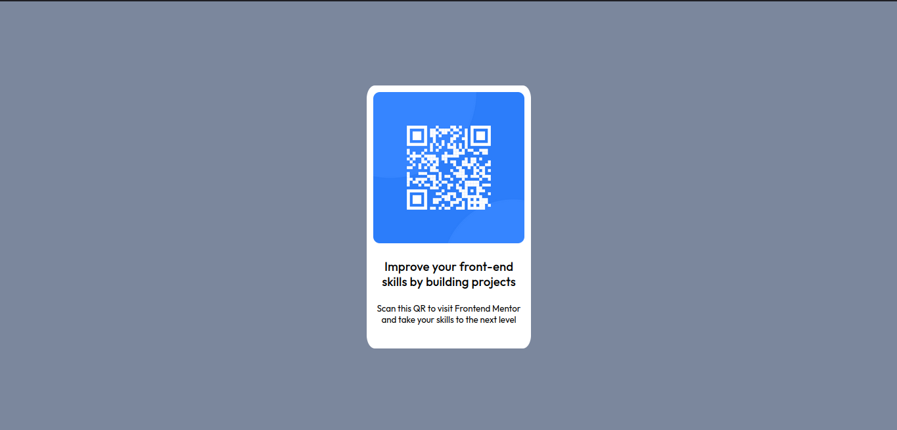

# Frontend Mentor - QR code component solution

This is a solution to the [QR code component challenge on Frontend Mentor](https://www.frontendmentor.io/challenges/qr-code-component-iux_sIO_H). Frontend Mentor challenges help you improve your coding skills by building realistic projects. 

## Table of contents

- [Overview](#overview)
- [Screenshot](#screenshot)
- [Links](#links)
- [My process](#my-process)
- [Built with](#built-with)
- [What I learned](#what-i-learned)
- [Continued development](#continued-development)
- [Useful resources](#useful-resources)
- [Author](https://github.com/Sami-Wafula/)
- [Acknowledgments](#acknowledgments)

## Overview

### Screenshot

### Links

- Live Site URL: [Live site](https://sami-wafula.github.io/qr-code-component/)

## My process

- Create skeleton using html
- Work out the magic with css

### Built with

- Semantic HTML5 markup
- CSS custom properties
- Flexbox

### What I learned

- HTML
- CSS

### Continued development

- CSS media queries to ensure cross-platform compatibility

### Useful resources

- www.w3schools.com
- Front-end mentor slack channel

## Author

- Blog - [Sami Wafula](https://medium.com/@samiwafula)

## Acknowledgments

- www.github.com/Missmacharia/ - fellow trainee at the Jitu cohort 7
- Jonathan Ndambuki - the Jitu cohort 7 trainer
